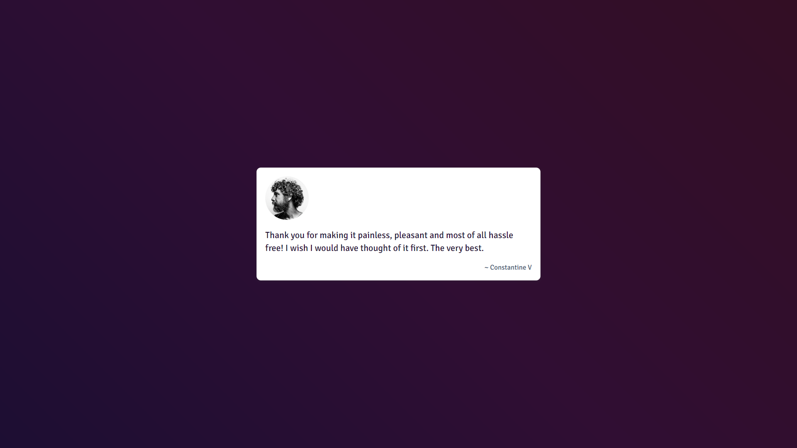

# Testimonials Slider



## Project Description

The Testimonials Slider is a responsive web component designed to elegantly display customer feedback. This slider automatically transitions between different testimonials, providing a smooth and engaging user experience. Built with HTML, CSS, and JavaScript, it adapts to various screen sizes and can be easily customized to fit different design needs.

You can view the live demo of the project [here](https://rajiv-0920.github.io/Testimonials-Slider/).

The source code for this project is available on [GitHub](https://github.com/Rajiv-0920/Testimonial-Slider.git).

## Table of Contents

- [Testimonials Slider](#testimonials-slider)
  - [Project Description](#project-description)
  - [Table of Contents](#table-of-contents)
  - [How to Install and Run the Project](#how-to-install-and-run-the-project)
  - [How to Use the Project](#how-to-use-the-project)
  - [Credits](#credits)
  - [How to Contribute to the Project](#how-to-contribute-to-the-project)
  - [Tests](#tests)

## How to Install and Run the Project

1. **Clone the Repository**

    ```bash
    git clone https://github.com/your-username/testimonials-slider.git
    ```

2. **Open the Slider**

    Open `index.html` in your preferred web browser to view the slider in action.

3. **Customization**

    - **CSS**: Modify `style.css` to adjust the visual style of the slider.
    - **JavaScript**: Update `index.js` to change the sliding interval or add new features.

## How to Use the Project

- **Automatic Sliding**: The testimonials slider automatically transitions every 7 seconds.
- **Responsive Design**: The slider adjusts its width based on the screen size, ensuring an optimal viewing experience across devices.
- **Customization**: Customize the appearance and behavior of the slider by editing the CSS and JavaScript files.

## Credits

- **Design and Development**: [Your Name](https://github.com/your-username)
- **Font**: [Signika Font](https://fonts.google.com/specimen/Signika)
- **Inspiration and Resources**: CSS Tricks for responsive design techniques.

## How to Contribute to the Project

1. **Fork the Repository**: Click the "Fork" button at the top right of this page.
2. **Clone Your Fork**:

    ```bash
    git clone https://github.com/your-username/testimonials-slider.git
    ```

3. **Create a Branch**:

    ```bash
    git checkout -b feature/your-feature
    ```

4. **Make Changes**: Implement your changes or new features.
5. **Commit Changes**:

    ```bash
    git add .
    git commit -m "Add new feature or fix"
    ```

6. **Push to GitHub**:

    ```bash
    git push origin feature/your-feature
    ```

7. **Create a Pull Request**: Go to the original repository and create a pull request from your forked repository.

## Tests

Currently, this project does not include automated tests. However, you can manually test the slider by opening `index.html` in various browsers and screen sizes to ensure it is responsive and functions correctly.